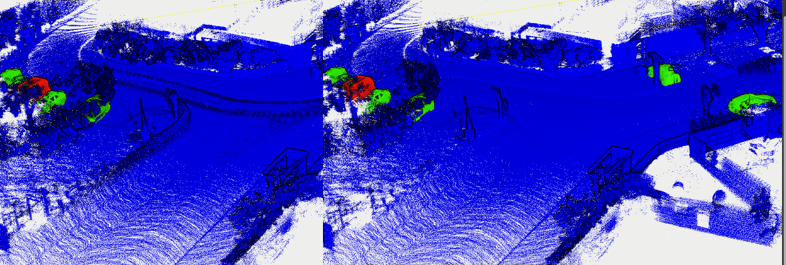

ERASOR
---

No ros version!

pcd are enough to run this program. Need transformed and pose in VIEWPOINT. Please reference our dufomap benchmark for more detail.

TODO add DUFOmap benchmark link Here!!!

We will output all the scripts and dataset! Don't worry. We are working on it. 
Message from [Qingwen ZHANG*](https://kin-zhang.github.io/) and [Daniel Duberg*](https://github.com/danielduberg)

## Install & Build

Test computer and System:

- Desktop setting: i9-12900KF, 64GB RAM, Swap 90GB, 1TB SSD
- System setting: Ubuntu 20.04
- Test Date: 2023/04/05
- Modified Version commit: https://github.com/Kin-Zhang/ERASOR/tree/7528b6672091213f113d253e23d5857a33208dc6


Dependencies:
### PCL


### glog gflag (only for debug)
glog gflag for debug only, will remove on release version
```sh
sh -c "$(wget -O- https://raw.githubusercontent.com/Kin-Zhang/Kin-Zhang/main/Dockerfiles/latest_glog_gflag.sh)"
```

### yaml-cpp
Please set the FLAG, check this issue if you want to know more: https://github.com/jbeder/yaml-cpp/issues/682, [TOOD inside the CMakeLists.txt](https://github.com/jbeder/yaml-cpp/issues/566)

If you install in Ubuntu 22.04, please check this commit: https://github.com/jbeder/yaml-cpp/commit/c86a9e424c5ee48e04e0412e9edf44f758e38fb9 which is the version could build in 22.04

```sh
cd ${Tmp_folder}
git clone https://github.com/jbeder/yaml-cpp.git && cd yaml-cpp
env CFLAGS='-fPIC' CXXFLAGS='-fPIC' cmake -Bbuild
cmake --build build --config Release
sudo cmake --build build --config Release --target install
```
### Build
```bash
mkdir build && cd build
cmake .. && make
```

## RUN

```
./erasor_run /home/kin/workspace/DUFOMap/data/KITTI_00 ../config/seq_00.yaml
```

I recommend to run 5-10 frames first to check the result, then run the whole sequence. Like here:
```
./erasor_run /home/kin/workspace/DUFOMap/data/KITTI_00 ../config/seq_00.yaml 5
```

Timing print in my desktop setting:
```bash
(140/142) Processing: /home/kin/workspace/DUFOMap/data/KITTI_00/pcd/004529.pcd Time Cost: 0.349648s          
ERASOR Timings:
         Component              Total   Last    Mean    StDev    Min     Max     Steps
         One Scan Cost          17.81   0.3496  0.5089  0.0677  0.3496  0.6520      35
        0. Read RawMap           0.81   0.8115  0.8115    nan   0.8115  0.8115       1
        1. Fetch VoI             3.82   0.0938  0.1092  0.0093  0.0842  0.1235      35
        2. Compare VoI           3.67   0.0291  0.1048  0.0331  0.0291  0.1729      35
        3. Get StaticPts         0.74   0.0120  0.0211  0.0061  0.0120  0.0438      35
        4. Write                 0.11   0.1114  0.1114    nan   0.1114  0.1114       1
I20230416 15:53:23.057607 41439 ERASOR_pcd.cpp:114] Done! Check the output in /home/kin/workspace/DUFOMap/data/KITTI_00/erasor_output.pcd
```

## Demo

You can use pcl_view to compare with gt under `/home/kin/workspace/DUFOMap/data/KITTI_00`, like this:
```
pcl_viewer -multiview 1 gt_cloud.pcd erasor_output.pcd
```
Or in CloudCompare:


**But DUFOMap is better** than ERASOR and fastest! please check our benchmark here [TODO](TODO)

DUFOMap Timing print in my desktop setting:
```bash
DUFOMap Timings
         Component      Total   Last    Mean    StDev    Min     Max     Steps
        0. Read          0.34   0.0022  0.0024  0.0007  0.0020  0.0079     141
        1. Integrate     8.79   0.0587  0.0624  0.0136  0.0472  0.1694     141
        2. Propagate     1.57   0.0107  0.0111  0.0033  0.0073  0.0320     141
        3. Clustering    0.23   0.2308  0.2308    nan   0.2308  0.2308       1
        4. Query         1.33   1.3294  1.3294    nan   1.3294  1.3294       1
        5. Write         8.23   8.2331  8.2331    nan   8.2331  8.2331       1
```